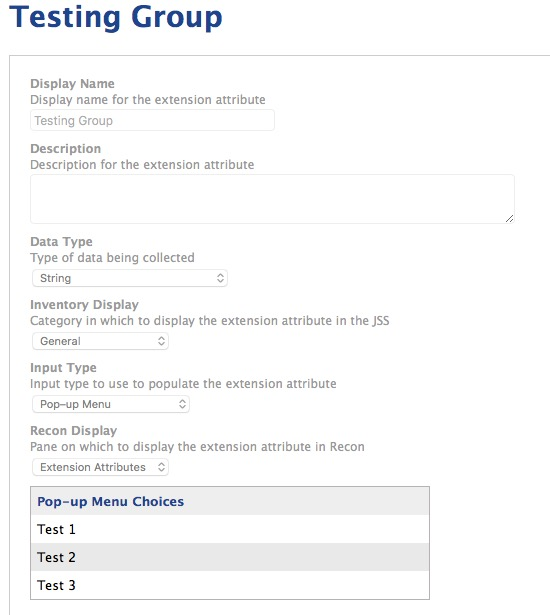
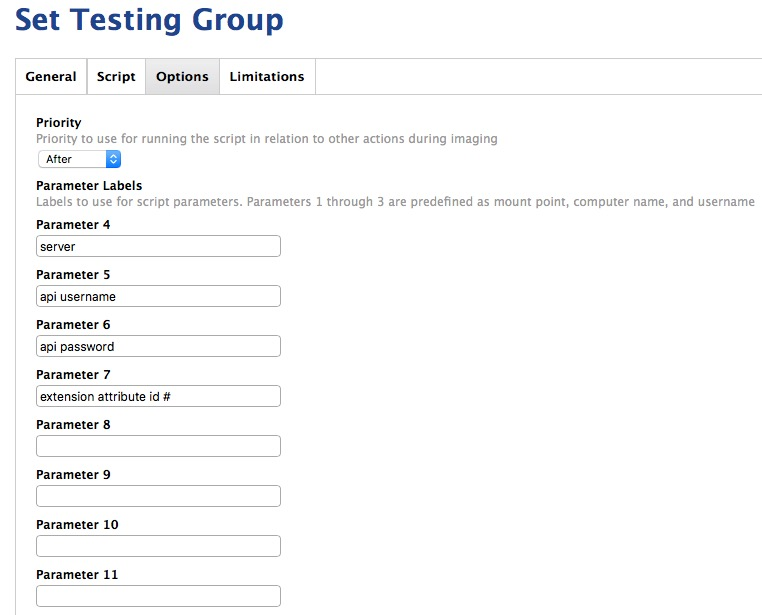
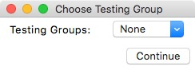
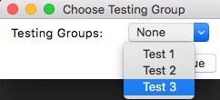
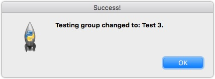
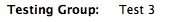

# Jamf Testing Group Enroll

Reads from an extension attribute in Jamf Pro with a list of testing group options, creates a Tkinter window,
and allows the user to choose a testing group and it writes that data back to the computer's inventory.
It is intended to be run via Self Service but can be run standalone.

This script allows a person to launch Self Service, run the policy with this script attached, set the EA value for a testing group they wanted to participate in, and then smart groups can use that EA value as criteria that can later be used for scoping different policies.

Of course this can be repurposed for any task where you want someone to have a convenient way to set an EA for their device without having access to the Jamf Pro server.

### Prerequesites

- An extension attribute in Jamf Pro that uses popup menu choices and it's internal ID number
- API auth credentials with privileges to at least read and update computers, computer extension attributes, and users objects (the users requirement being the result of a bug in Jamf Pro API handling of permissions)

### Setup

1. Create a string based extension attribute with the popup choices you want (note the ID)

	

2. Upload the script to the Jamf Pro server and set your parameter labels for easy referencing to the positional parameters
	- Parameter 4: Jamf Pro Server URL
	- Parameter 5: API Username
	- Parameter 6: API Password
	- Parameter 7: Extension Attribute ID #
	
	

3. Set up a Self Service policy, fill in your parameters with the necessary values, scope however you wish
4. Run the policy from Self Service
5. When it runs the script will pull the popup choice values from the extension attribute in Jamf Pro via the API and display them for the user:

	
	
	
	
6. The script will use the serial number of the computer to target updating the value of the extension attribute in the computers inventory record
7. The user will get a quick message saying the change was successful:
	

Now when you view the extension attribute for the computer's inventory record, you should see the update:

